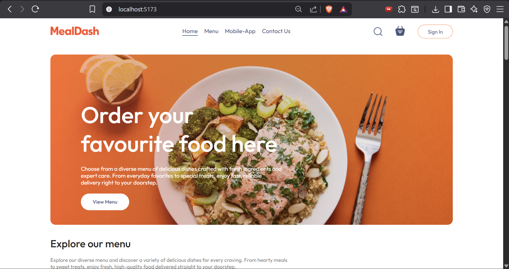
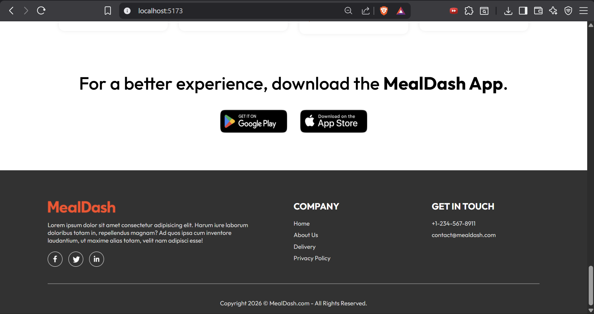
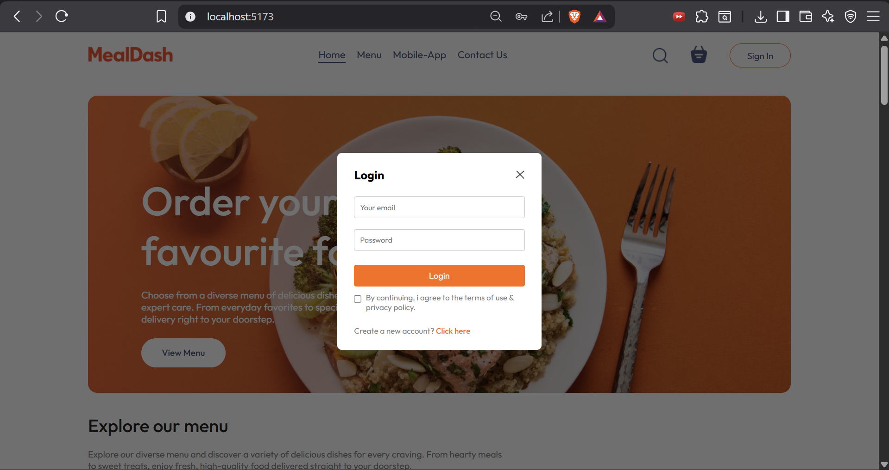
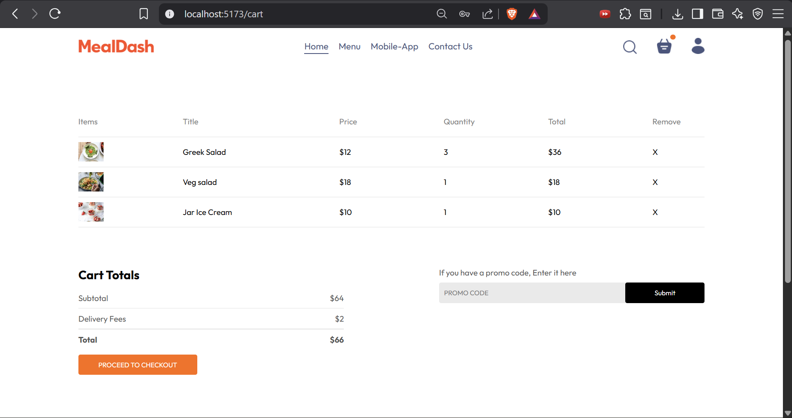
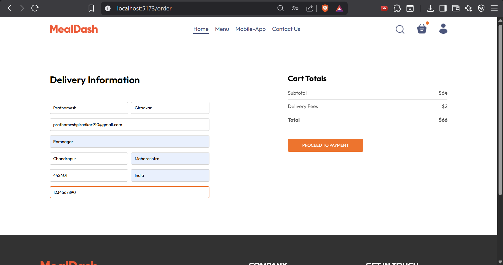
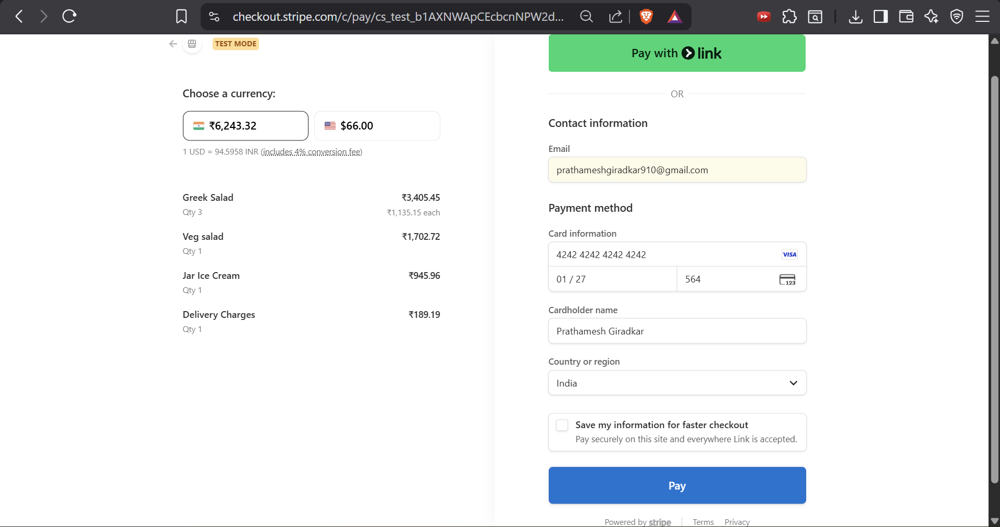
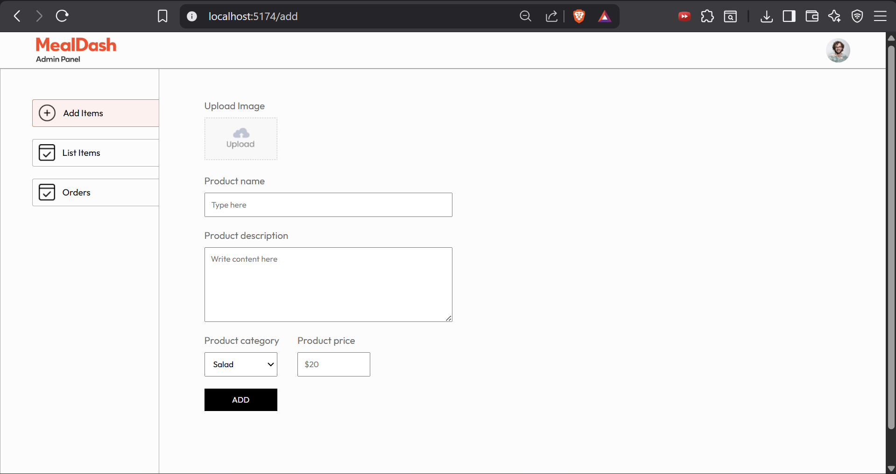
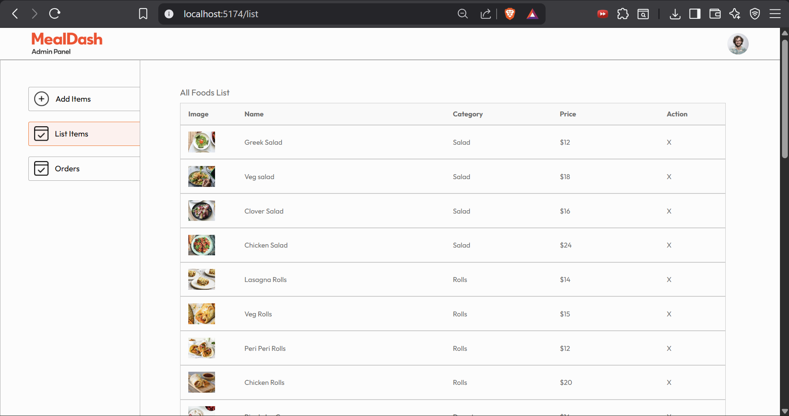

# 🍽️ MealDash

**MealDash** is a modern, full-stack food ordering platform designed to provide a seamless experience for both customers and restaurant administrators. The platform consists of three main components:

1. **User App (Frontend):**  
   A responsive and interactive web application built with React and Vite, allowing users to browse a curated food menu, add items to their cart, place orders, and track order history. The user app integrates with a payment gateway for secure online payments, ensuring a smooth ordering experience.

2. **Admin Dashboard (Frontend):**  
   A dedicated admin panel built with React and Vite that enables restaurant staff or administrators to manage the menu, add or remove food items, monitor incoming orders, and handle order status updates. Admins can also manage food images and pricing dynamically, making menu management fast and convenient.

3. **Backend API:**  
   A robust Node.js and Express server with MongoDB as the database. The backend handles user authentication with JWT, cart management, order processing, payment verification, and secure image uploads. The RESTful API serves both the frontend user app and admin dashboard, ensuring smooth communication and real-time updates.

---

## # Project Structure

```
MealDash/
├── frontend/   → User web app (React + Vite)
├── admin/      → Admin dashboard (React + Vite)
└── backend/    → REST API (Node.js + Express + MongoDB)
```

---

## # Features

### 1. User App

- Browse food menu
- Add items to cart
- User authentication
- Place orders
- Online payment verification
- View order history

### 2. Admin Dashboard

- Add / delete food items
- View all orders
- Manage menu images

### 3. Backend API

- JWT authentication
- Cart management
- Order processing
- Payment verification
- Image upload
- MongoDB database

---

## # Tech Stack

### 1. Frontend & Admin

- React
- Vite
- React Router DOM
- Axios
- React Toastify

### 2. Backend

- Node.js
- Express.js
- MongoDB + Mongoose
- JWT
- bcrypt
- Multer
- Stripe
- CORS
- dotenv

---

## # Environment Variables (Backend)

Create a `.env` file inside **backend/**:

```
MONGO_URI=your_mongodb_connection_string
JWT_SECRET=your_secret_key
STRIPE_SECRET_KEY=your_stripe_secret
PORT=4000
```

---

## # Installation

Install dependencies for all apps:

### 1. Backend

```
cd backend
npm install
```

### 2. Frontend

```
cd frontend
npm install
```

### 3. Admin

```
cd admin
npm install
```

---

## # Running the Project

**1. Backend**

```
cd backend
npm run server
```

**2. Frontend (User App)**

```
cd frontend
npm run dev
```

**3. Admin Dashboard**

```
cd admin
npm run dev
```

---

## # Default URLs

- User App → [http://localhost:5173](http://localhost:5173)
- Admin Panel → [http://localhost:5174](http://localhost:5174)
- Backend API → [http://localhost:4000](http://localhost:4000)

---

## # API Base URL

Frontend should use:

```
http://localhost:4000
```

---

## # Screenshots

### 1. Homepage — Top Section

Landing page with featured food items and navigation bar.



---

### 2. Homepage — Food Listing

Dynamic food cards fetched from backend.


---

### 3. Homepage — Footer

Footer with app info and links.



---

### 4. Login / Register

User authentication popup for login and signup.



---

### 5. Cart Page

Selected items with quantity control and total calculation.



---

### 6. Checkout Page

Address form and order summary before payment.



---

### 7. Payment Integration

Stripe payment gateway interface.



---

### 8. User Orders History

List of all orders placed by the user.


---

### 9. Admin — Add Food

Admin panel form to add new food items.



---

### 10. Admin — Food List

View and manage all added food items.



---

### 11. Admin — Orders Management

Admin dashboard to manage user orders.


---

## # Live Demo

- User App: https://mealdash-frontend-ng75.onrender.com
- API: https://mealdash-p5sp.onrender.com

---

## # Author

**Prathamesh Giradkar**

- GitHub: https://github.com/Prathamesh910
- LinkedIn: https://www.linkedin.com/in/prathameshgiradkar/
